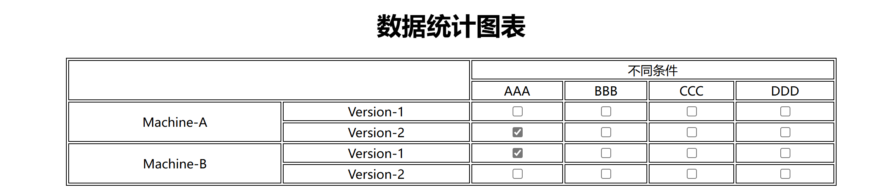
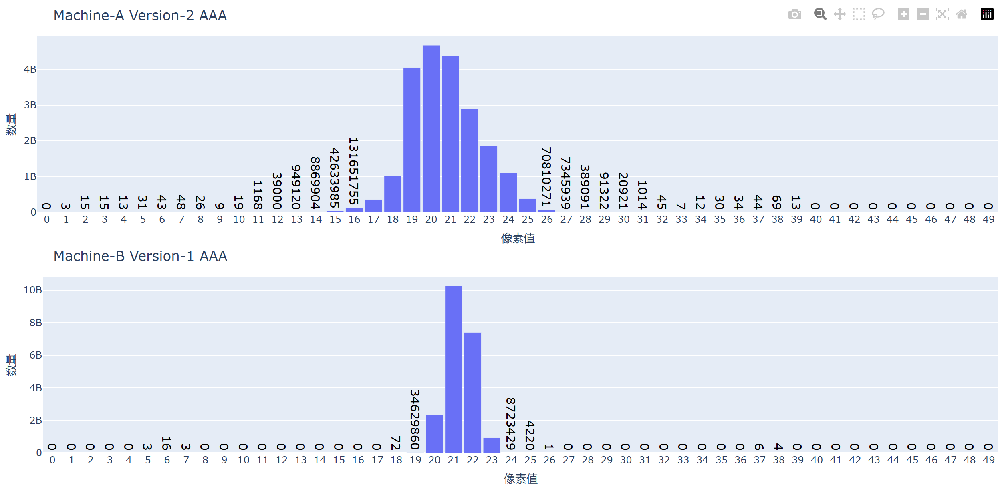

# 使用 plotly 画直方图

## 结果展示
最后生成一个 HTML 文件，包含两个部分，一个是可以进行选择的表格，另一个是对应的展示图：

## 执行
`python src/main.py`

## 说明
1. 直方图中较少的块会在图上显示其对应值的数字，并且数字的大小都是一样的。具体实现在 `src/gen_charts.py` 中，里面进行了一些注释说明。
2. 最后将图表转为 html 文件时，要使用 `fig.to_html(full_html=False, include_plotlyjs=False)`，这样可以防止每一个图表都会生成一个很大的结果。注意第一张图片要使用 `include_plotyjs=True`，详情可以参考 `src/main.py`。
3. 想要将 plotly 生成的图表一开始不显示。如果 HTML 文件默认为 `none`，那么图表的大小会失准。因此需要先设为 `block`，在最终生成的 HTML 文件里让 HTML 文件加载后再将这些图表变为 `none`。具体实现在 `src/main.py` 和 `src/template.html` 文件中。
